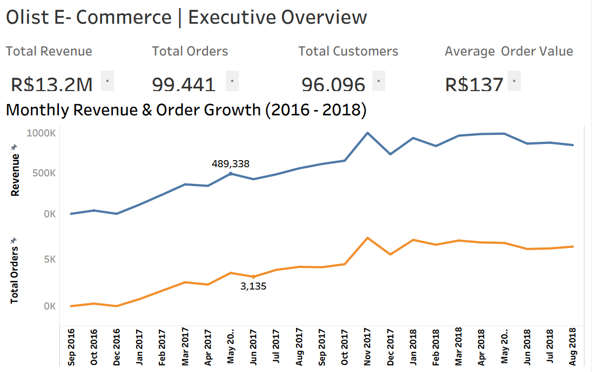
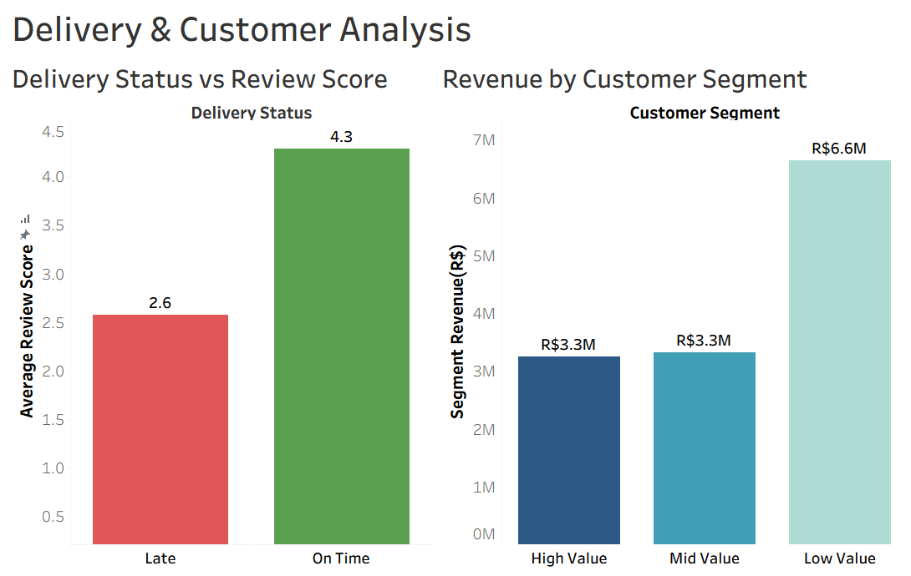
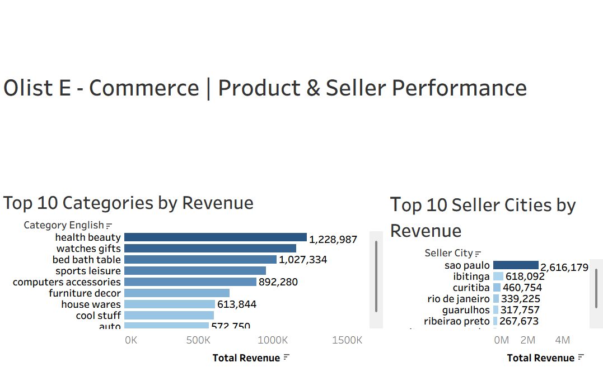

# Olist E-Commerce: End to End Business Performance Analysis
### SQL Server + Tableau | Business Intelligence Project

---

## Table of Contents
1. [Project Overview](#project-overview)
2. [Business Questions](#business-questions)
3. [Tools & Dataset](#tools--dataset)
4. [Database Schema](#database-schema)
5. [SQL Analysis](#sql-analysis)
6. [Key Findings](#key-findings)
7. [Tableau Dashboards](#tableau-dashboards)
8. [Recommendations](#recommendations)
9. [Files in This Repository](#files-in-this-repository)

---

## Project Overview

This project performs a full end to end business performance analysis on the **Olist Brazilian E-Commerce dataset**  one of the most comprehensive real world e-commerce datasets publicly available. 

Using **SQL Server** for data extraction and analysis, and **Tableau** for visualization, this project covers revenue growth, customer behavior, delivery performance, seller rankings, and product category insights across a two year period (2016-2018).

---

## Business Questions

1. What are the overall business KPIs  revenue, orders, customers, and average order value?
2. How has revenue and order volume grown month over month?
3. Does late delivery hurt customer satisfaction  and by how much?
4. Which customers are the most valuable, and how much do different segments contribute to revenue?
5. Which sellers are performing best by revenue and rating?
6. Which product categories drive the most revenue?
7. How do customers prefer to pay?

---

## Tools & Dataset

| Component | Detail |
|---|---|
| **Database** | Microsoft SQL Server |
| **Visualization** | Tableau Desktop |
| **Dataset** | [Brazilian E-Commerce Public Dataset by Olist](https://www.kaggle.com/datasets/olistbr/brazilian-ecommerce) |
| **License** | CC BY-NC-SA 4.0 |
| **Data Period** | September 2016 -  August 2018 |

---

## Database Schema

The dataset consists of multiple joined tables:

```
olist_orders_dataset           — order status, timestamps, delivery dates
olist_order_items_dataset      — price, freight per item
olist_customers_dataset        — customer ID, location
olist_sellers_dataset          — seller ID, city, state
olist_products_dataset         — product ID, category
olist_order_reviews_dataset    — review score per order
olist_order_payments_dataset   — payment type, value, installments
product_category_name_translation — Portuguese to English category names
```

All queries filter on `order_status = 'delivered'` to ensure only completed transactions are included in revenue and performance metrics.

---

## SQL Analysis

### Query 01 - Executive KPI Summary
**File:** `01_executive_kpi_summary.sql`

Pulls the four core business KPIs in a single query:
- Total Revenue
- Total Orders
- Total Unique Customers
- Average Order Value
- Total Freight Cost

---

### Query 02 - Monthly Revenue & Order Growth
**File:** `02_monthly_revenue_order_growth.sql`

Breaks down revenue, order count, freight cost, and average order value **by month** from 2016 to 2018. Enables trend analysis and growth tracking over time.

---

### Query 03 - Late Delivery & Review Impact
**File:** `03_late_delivery_review_impact.sql`

Uses a CTE to classify each order as **Late** or **On Time** based on estimated vs. actual delivery date. Then calculates:
- Total orders per delivery status
- Average review score per group
- Average delay in days

---

### Query 04 - Customer Segmentation by Spend
**File:** `04_customer_segmentation_by_spend.sql`

Uses a CTE to calculate total spend per customer, then classifies each into:
- **High Value** -  R$500+
- **Mid Value** - R$200–R$499
- **Low Value** -  under R$200

---

### Query 05 - Customer Segment Revenue Contribution
**File:** `05_customer_segment_revenue_contribution.sql`

Extends the segmentation query to show:
- How many customers fall into each tier
- Total revenue generated per segment
- Average spend per customer per segment

---

### Query 06 - Seller Performance Ranking
**File:** `06_seller_performance_ranking.sql`

Uses `RANK() OVER` window function to rank all sellers by total revenue. Also surfaces:
- Total orders per seller
- Average customer review rating
- Seller city and state

---

### Query 07 - Top Categories by Revenue
**File:** `07_top_categories_by_revenue.sql`

Joins product, order, and review tables to rank product categories by total revenue. Uses `COALESCE` to handle unmapped category names and `RANK() OVER` for the final ranking.

---

### Query 08 - Payment Method Breakdown
**File:** `08_payment_method_breakdown.sql`

Analyzes how customers pay  by payment type, total transaction value, and average installments used.

---

## Key Findings

### Executive KPIs

| Metric | Value |
|---|---|
| Total Revenue | **R$13.2M** |
| Total Orders | **99,441** |
| Total Customers | **96,096** |
| Average Order Value | **R$137** |

---

### Finding 1 -  Steady Revenue Growth Over Two Years



Revenue grew from near zero in September 2016 to a peak of approximately **R$1M per month by November 2017**, driven by a major surge in order volume in Q4 2017  consistent with Black Friday / holiday season demand. Revenue then stabilized between R$750K-R$1M monthly through mid-2018.

Order volume followed the same trajectory, peaking at over **7,000 orders in a single month**. This consistent upward trend confirms strong business growth across the two year period.

---

### Finding 2 - Late Delivery Cuts Review Scores Nearly in Half



| Delivery Status | Avg Review Score |
|---|---|
| On Time | **4.3 / 5** |
| Late | **2.6 / 5** |

Late deliveries result in a **40% drop in average customer review score**   from 4.3 down to 2.6. This is the single clearest driver of customer dissatisfaction in the entire dataset. Delivery performance is not a logistics issue; it is a customer retention issue.

---

### Finding 3 - Low Value Customers Generate the Most Revenue in Total

| Customer Segment | Segment Revenue |
|---|---|
| High Value (R$500+) | R$3.3M |
| Mid Value (R$200–R$499) | R$3.3M |
| **Low Value (under R$200)** | **R$6.6M** |

Despite spending the least per transaction, the Low Value segment generates **double the revenue** of either the High or Mid Value segments combined. This is purely a volume effect — there are far more low-value customers than high value ones. The business currently runs on breadth, not depth.

---

### Finding 4 - Health & Beauty Is the Top Revenue Category



| Rank | Category | Revenue |
|---|---|---|
| 1 | Health & Beauty | R$1,228,987 |
| 2 | Watches & Gifts | — |
| 3 | Bed, Bath & Table | R$1,027,334 |
| 4 | Sports & Leisure | — |
| 5 | Computers & Accessories | R$892,280 |

Health & Beauty leads all categories by a significant margin   nearly 20% ahead of the third place category. This category also tends to have repeat purchase behavior, making it strategically valuable beyond its raw revenue figure.

---

### Finding 5 - São Paulo Dominates Seller Geography

| Seller City | Revenue |
|---|---|
| São Paulo | R$2,616,179 |
| Ibitinga | R$618,092 |
| Curitiba | R$460,754 |
| Rio de Janeiro | R$339,225 |

São Paulo sellers generate over **4x the revenue** of the next highest city. The seller base is heavily concentrated geographically, which creates both supply chain efficiency in São Paulo and a risk of over-dependence on a single region.

---
---

## Recommendations

**1. Fix Late Deliveries -  It Is the Biggest Lever for Customer Satisfaction**
A 40% drop in review score for late orders is severe. Olist should audit the sellers and logistics partners with the highest late delivery rates and prioritize operational fixes there before expanding into new categories or markets.

**2. Develop a High Value Customer Retention Strategy**
High and Mid Value customers each generate R$3.3M but in far fewer transactions. Losing even a fraction of these customers is costly. Loyalty programs, priority shipping, or personalized offers should be targeted specifically at customers spending R$200+.

**3. Invest in the Low Value Segment at Scale**
Low value customers drive R$6.6M in revenue through volume. The strategy here is not to push them to spend more it is to reduce churn and keep acquisition costs low. Email re-engagement campaigns and low friction repeat purchase experiences are the right tools.

**4. Double Down on Health & Beauty**
As the top revenue category with natural repeat purchase behavior, Health & Beauty deserves dedicated seller recruitment, promotional investment, and category expansion. It is the strongest product market fit signal in the dataset.

**5. Expand the Seller Base Outside São Paulo**
With São Paulo generating 4x the next city's revenue, the business has a geographic concentration risk. Recruiting quality sellers from Rio de Janeiro, Curitiba, and other cities would diversify supply and potentially improve delivery times for customers outside the São Paulo region.

---


---

## About

**Analyst:** Ayesha Nisar  
**Tools:** SQL Server · Tableau  
**Dataset:** [Brazilian E-Commerce Public Dataset — Olist](https://www.kaggle.com/datasets/olistbr/brazilian-ecommerce) · CC BY-NC-SA 4.0
